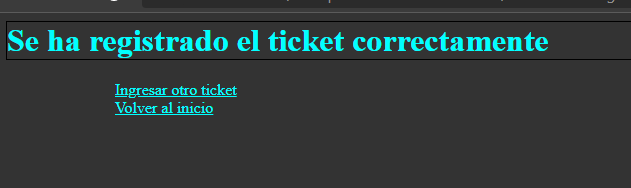

>   **Recuperación**

>   **Nombre**: Bryam Guzman

1.  **Base de Datos**

Un cliente puede tener varios autos

Un auto puede tener varios tickets

1.  **Ingresar Ticket**

Servlet Ingresar Ticket

Resultado: Ingresar Ticket

1.  **Listar Tickets por Cedula**

Servlet: Listar Ticket

Método FindByCedula

Resultado: Buscar por Cedula

1.  **Buscar por Placa**

Servlet Listar Ticket

Resultado: Buscar por Placa
